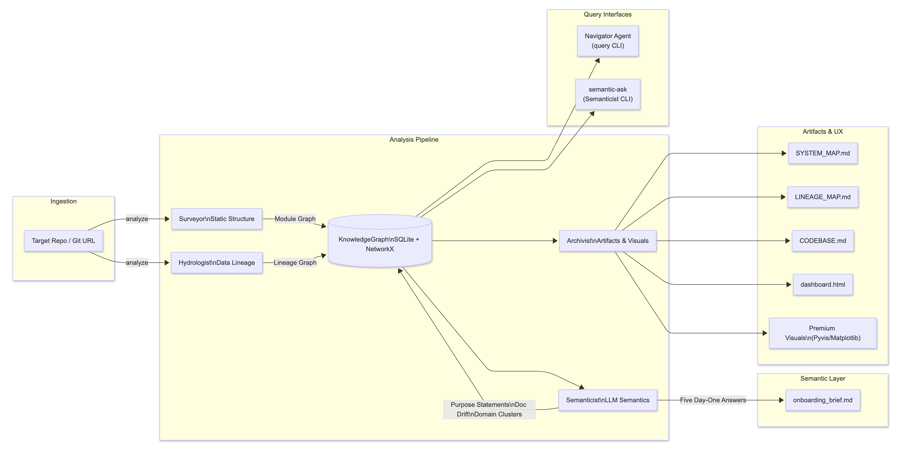
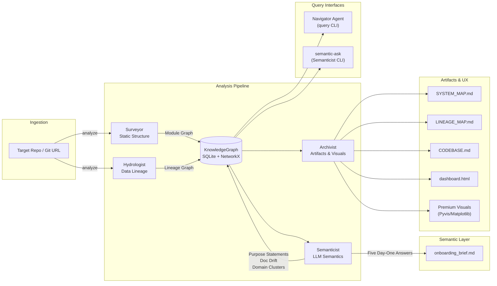

# The Brownfield Cartographer — Final Report

## Executive Summary

The Brownfield Cartographer has evolved from a static structural and lineage analyzer (interim scope) into a **multi-agent, graph-backed onboarding and query system** that now supports:

- End‑to‑end analysis of codebases into a **living knowledge graph** (modules + lineage).
- Automated generation of **FDE onboarding artifacts** (`onboarding_brief.md`, `CODEBASE.md`, maps, dashboard).
- **Interactive, graph-aware querying** via Navigator (lineage, blast radius, semantic module inspection).
- A **Semanticist CLI** (`semantic-ask`) that answers free‑form architecture questions grounded in graph context.
- A UX‑focused visualization layer with **curated, readable maps** for large codebases.

This report consolidates the interim progress with the new capabilities added since then, and supersedes the interim report.

---

## Manual Reconnaissance Depth (Standalone Ground Truth)

This section records the hand-conducted Day-One analysis used as ground truth before automation.

- **Chosen target codebase**: `dbt-labs/jaffle_shop`
- **Manual evidence source**: `RECONNAISSANCE.md`

### Q1. Primary data ingestion path

Primary ingestion occurs through dbt seeds in `seeds/`:

- `seeds/raw_customers.csv` -> dataset `raw_customers`
- `seeds/raw_orders.csv` -> dataset `raw_orders`
- `seeds/raw_payments.csv` -> dataset `raw_payments`

These are the only external inputs in the project and feed all downstream staging/final models.

### Q2. 3-5 most critical output datasets/endpoints

Most critical outputs identified manually:

1. `customers` in `models/customers.sql` (final customer analytics table: LTV, order counts, first/last order dates).
2. `orders` in `models/orders.sql` (order-level fact output with payment rollups/status).
3. `stg_customers` in `models/staging/stg_customers.sql` (critical cleaned upstream dependency).
4. `stg_orders` in `models/staging/stg_orders.sql` (critical cleaned upstream dependency).
5. `stg_payments` in `models/staging/stg_payments.sql` (critical cleaned upstream dependency).

### Q3. Blast radius of the most critical module

Manual blast-radius assessment for `models/staging/stg_orders.sql`:

- Direct downstream break: `models/orders.sql`
- Indirect downstream break: `models/customers.sql`
- Practical impact: core analytical outputs (`orders`, `customers`) become unavailable.

If ingestion table `raw_orders` fails, the same cascade occurs: `raw_orders` -> `stg_orders` -> `orders` -> `customers`.

### Q4. Where business logic is concentrated vs. distributed

Manual conclusion:

- **Concentrated logic**:
  - `models/customers.sql` (multi-CTE aggregation for customer metrics/LTV)
  - `models/orders.sql` (payment aggregation/status and order-level joins)
- **Distributed low-complexity prep**:
  - Staging layer under `models/staging/` (`stg_customers.sql`, `stg_orders.sql`, `stg_payments.sql`) primarily performs rename/cleaning transformations.

### Q5. What changed most frequently in the last 90 days

Manual git-velocity reading:

- Project is stable with low recent code churn.
- Historically most-touched files are non-core SQL assets (notably `README.md` and `dbt_project.yml`).
- Core SQL model files under `models/` show near-zero recent change velocity.

### Difficulty Analysis (What Was Hardest Manually)

Hardest manual tasks and why they matter architecturally:

1. **Tracing deep CTE flows in `models/customers.sql`**.
  Manual reconstruction across chained CTEs (`customers`, `orders`, `payments`, `customer_orders`, `customer_payments`, `final`) was slow and error-prone.
2. **Resolving dbt `ref()` links across files without compiled docs**.
  Mapping `ref('stg_orders')`/`ref('stg_customers')` to actual source files required repetitive cross-file navigation.
3. **Inferring schema and transformation intent from mixed SQL + YAML context**.
  `models/schema.yml` validates columns/tests but does not fully expose transformation semantics, forcing parallel reading of SQL and YAML.

Connection to automation priorities in this project:

- Prioritized graph extraction for model dependencies and lineage (`sql_lineage.py`, `dag_config_parser.py`).
- Prioritized central graph analytics for impact traversal/blast radius (`knowledge_graph.py`).
- Prioritized semantic summarization into onboarding artifacts to replace fragile manual synthesis (`semanticist.py`, `onboarding_brief.md`).

This section is intentionally standalone and serves as manual baseline evidence independent of system-generated outputs.

---

## 1. Architecture Overview

The core architecture is a **four‑agent pipeline** orchestrated by `Orchestrator`, with shared storage in a SQLite‑backed `KnowledgeGraph` and multiple interaction surfaces (CLI, dashboard, Navigator).

### 1.1 Agents

- **Surveyor Agent** (`src/agents/surveyor.py`):
  - Static structure analysis using Tree‑sitter and heuristics.
  - Builds the **module graph** (Python + SQL, including dbt `ref()` edges).
  - Adds complexity metrics, git velocity, PageRank, and dead‑code flags.

- **Hydrologist Agent** (`src/agents/hydrologist.py`):
  - Data lineage analysis across SQL, dbt configs, Airflow DAGs, Python data ops, and notebooks.
  - Builds the **lineage graph** (datasets + transformations).
  - Computes sources, sinks, and blast‑radius style traversals.

- **Semanticist Agent** (`src/agents/semanticist.py`):
  - LLM‑powered semantic layer using `llama3.1` via Ollama.
  - Generates **purpose statements** and **doc‑drift flags** per module.
  - Clusters modules into **semantic domains** via TF‑IDF + K‑Means.
  - Synthesizes the **Five Day‑One Questions** into `onboarding_brief.md`.
  - Answers **free‑form architecture questions** via a new `ask()` method.

- **Archivist Agent** (`src/agents/archivist.py`):
  - Converts graphs into **Mermaid maps** (`SYSTEM_MAP.md`, `LINEAGE_MAP.md`).
  - Generates a **living `CODEBASE.md`** (critical hubs, sources, sinks) for AI context injection.
  - Emits an **interactive dashboard** (`dashboard.html`) backed by serialized graphs.
  - Produces “premium” visualizations (Pyvis HTML network and Matplotlib PNG).

### 1.2 Knowledge Graph Layer

The **KnowledgeGraph** (`src/graph/knowledge_graph.py`) is the central store:

- Persists nodes and edges in SQLite with indices and metadata.
- Exposes a NetworkX DiGraph for:
  - PageRank (architectural hubs).
  - Strongly connected components (cycles).
  - Blast radius (downstream BFS).
  - Sources/sinks, topological sorts, and custom SQL queries.
- Serializes to/from JSON (`module_graph.json`, `lineage_graph.json`) for portability.

### 1.3 Interaction Surfaces

- **CLI entrypoint** (`src/cli.py`):
  - `analyze` — full multi‑agent pipeline.
  - `visualize` — regenerate premium visualizations from existing graphs.
  - `query` — Navigator REPL for graph‑aware codebase Q&A.
  - `semantic-ask` — new CLI verb for free‑form Semanticist questions.

- **Navigator Agent** (`src/agents/navigator.py`):
  - Provides LangChain tools backed by the graphs:
    - `find_implementation`, `trace_lineage`, `blast_radius`, `explain_module`.
  - Runs a manual ReAct loop in the terminal for interactive exploration.

### 1.4 End‑to‑End Architecture Diagram

The full Cartographer pipeline, consolidated across interim and final additions (including query surfaces), is:



---

## 2. Static Structure & Module Graph (Surveyor)

### 2.1 Capabilities

Surveyor performs deep static analysis to build the **structural skeleton**:

- **Language coverage**:
  - Python, SQL, YAML via Tree‑sitter with regex fallbacks.
- **Module discovery and imports**:
  - Resolves Python imports and dbt `ref()` relationships.
  - Categorizes modules as model/interface/logic/utility/unknown.
- **Metrics**:
  - Lines of code, comment ratios, simple complexity signals.
  - 30‑day git velocity and recent commit summaries per file.
- **Graph features**:
  - PageRank‑based identification of critical files.
  - Circular dependency detection via SCCs.
  - Dead‑code candidate detection (public APIs never imported).

### 2.2 Refinements since Interim

- **Incremental mode**:
  - `analyze --incremental` reloads previous module graph, diffs commits, and only re‑analyzes changed files.
  - Safely prunes deleted nodes and rebuilds import edges.
- **Semantic integration**:
  - Surveyor now persists commit history snippets on nodes.
  - Semanticist consumes these to reason about **documentation drift**.

---

## 3. Data Lineage & Blast Radius (Hydrologist)

### 3.1 Capabilities

Hydrologist constructs the **data lineage DAG**:

- **SQL lineage** (`sqlglot`):
  - Parses multi‑dialect SQL, strips dbt Jinja, resolves `ref()` and `source()` calls.
- **Config parsing** (`DAGConfigParser`):
  - Extracts datasets and edges from dbt YAML, Airflow DAGs, and other config surfaces.
- **Python & notebooks**:
  - Detects `pandas`, PySpark, and SQLAlchemy read/write operations.
  - Analyzes Jupyter notebooks via a dedicated analyzer, capturing exploratory data flows.

The lineage graph includes:

- **Dataset nodes** (tables/files/logical datasets).
- **Transformation nodes** (SQL statements + Python ops).
- **Edges**:
  - `CONSUMES` (dataset → transform).
  - `PRODUCES` (transform → dataset).
  - Edges carry `source_file` and, when available, `line_range`.

### 3.2 Blast Radius & Tracing

Hydrologist leverages `KnowledgeGraph` algorithms:

- `blast_radius(node_id)`:
  - BFS downstream to compute all dependents of a dataset or transformation.
- `upstream_trace(node_id)`:
  - BFS upstream to find all ancestral inputs.

These are surfaced both:

- Programmatically via Hydrologist / KnowledgeGraph.
- Interactively via Navigator and the `trace_lineage` tool (with file/line citations).

### 3.3 Robustness

- Dynamic or unresolvable references (e.g., f‑strings, variable paths) are logged as trace entries instead of silently dropped, making partially inferred lineage explicit.

---

## 4. Semantic Layer (Semanticist)

### 4.1 Purpose Statements & Documentation Drift

Semanticist enriches the module graph with **LLM‑generated semantics**:

- Prioritizes modules by PageRank and caps analysis to a configurable budget (typically top 50).
- For each module:
  - Reads code with token budgeting and truncation safeguards.
  - Produces a 1–2 sentence **purpose statement**.
  - Flags **documentation drift** when comments/history diverge from behavior.
- Writes this back into `.cartography/module_graph.json`, enabling:
  - Richer `CODEBASE.md`.
  - Semantic Navigator queries (`explain_module`, `find_implementation`).

### 4.2 Domain Clustering

- Uses TF‑IDF + K‑Means clustering on purpose statements.
- Assigns `domain_cluster` labels (e.g., `Domain_orders-payments`).
- Helps group modules conceptually beyond raw directory structure.

### 4.3 Day‑One Brief

Semanticist answers the **Five FDE Day‑One Questions**:

- Builds a compact JSON context from the graphs:
  - Top PageRank hubs.
  - Representative data sources and sinks.
  - Purpose statements for key modules.
- Uses a “pro” LLM call to generate a Markdown brief:
  - Saved as `.cartography/onboarding_brief.md`.
  - Validated on `dbt-labs/jaffle_shop` by directly comparing claims with:
    - Staging and final model SQL files.
    - Graph structures and PageRank outputs.

### 4.4 Free‑Form Semantic Q&A (CLI: `semantic-ask`)

New: **terminal‑driven semantic queries**.

- Command:

  ```bash
  python -m src.cli semantic-ask <repo_path> -q "Your architecture question"
  ```

- Behavior:
  - Resolves `<repo_path>` and loads `.cartography/module_graph.json`.
  - Builds a compact context (`critical_hubs`, `data_sources`, `data_sinks`, `module_purposes`).
  - Calls `SemanticistAgent.ask(question)` with strict, context‑only instructions.
  - Prints an answer that:
    - Cites real modules and datasets.
    - Admits unknowns if context is insufficient.

- Example (validated on `jaffle_shop`):
  - Question: “Where is revenue calculated and what does it depend on?”
  - Answer:
    - Identifies `models/orders.sql` as the aggregation point for order amounts.
    - Notes dependencies on staging models backed by `raw_orders` and `raw_payments`.
    - Clearly states when a specific “revenue” column name is not present in the context.

---

## 5. Artifact Generation & Visualization (Archivist)

### 5.1 CODEBASE.md — Living Context for AI

Archivist generates a **concise yet rich** `CODEBASE.md` for each analyzed repo:

- **Critical Architectural Hubs**:
  - Top modules by PageRank, each with a purpose statement.
- **Data Sources & Sinks**:
  - Entry points (sources) and terminal outputs (sinks).

This file is designed to be:

- Readable by humans as a one‑page architecture overview.
- Dropped directly into AI agents as a “living system prompt” to drastically improve answer quality (validated in Step‑5 demos).

### 5.2 System Map (`SYSTEM_MAP.md`)

Improvements since interim:

- Focus on **top N modules by PageRank** (default ~80) for large repos.
- Filter edges to only those with both endpoints in this selected set.
- Use concise node labels (file basenames) for readability.
- Add a coverage note such as:
  - “This view shows the top 80 of 400 modules by structural importance.”

Result: a map that surfaces the architecture’s backbone without overwhelming the viewer.

### 5.3 Lineage Map (`LINEAGE_MAP.md`)

Refined for legibility:

- Focuses on:
  - Key sources and sinks (top ~20 each).
  - Their immediate predecessors and successors.
- Caps total nodes to a reasonable limit (~150).
- Only shows edges where both datasets are in the visible subset.
- Includes a coverage note such as:
  - “This view focuses on key sources/sinks and nearby nodes (X of Y lineage nodes).”

This is suitable for onboarding sessions and documentation, while full JSON exports and the dashboard support deeper forensic work.

### 5.4 Interactive Dashboard & Premium Visuals

- **Dashboard (`dashboard.html`)**:
  - Static HTML + JS using Cytoscape.js and pre‑injected graph JSON.
  - Supports pan/zoom, highlighting, and basic filtering between module and lineage views.

- **Premium Visualizations**:
  - Pyvis HTML network:
    - Physics‑enabled, colored by node type.
    - Hubs highlighted with larger, warmer nodes based on PageRank.
  - Matplotlib PNG:
    - Dark‑mode architecture overview with legend and category coloring.

---

## 6. Interactive Query Layer (Navigator)

### 6.1 Tools

Navigator exposes graph tools to the LLM and users:

- `find_implementation(concept_or_keyword)`:
  - Searches module IDs, purpose statements, and public APIs for a concept.

- `trace_lineage(dataset_id, direction)`:
  - `direction="upstream"` — what feeds this dataset.
  - `direction="downstream"` — what this dataset feeds.
  - Returns human‑readable bullets with **file:line‑style citations** based on:
    - `source_file` on edges.
    - `line_range` on nodes, when available.

- `blast_radius(module_path)`:
  - Computes modules that directly depend on the given module via import graph edges.
  - Used to reason about **impact of code changes**.

- `explain_module(module_path)`:
  - Surfaces language, domain cluster, purpose, complexity, API size, and doc‑drift status.

### 6.2 REPL Experience

`python -m src.cli query <repo_path>`:

- Uses a ReAct‑style loop where an LLM:
  - Thinks, selects a tool, observes, and synthesizes a final answer.
  - Streams its thought process (Thought/Action/Observation) in the terminal.

This is ideal for:

- Live demos of blast radius and lineage queries.
- Ad‑hoc Q&A sessions with a codebase.

---

## 7. Validation & Self‑Audit

### 7.1 Targets

- **dbt‑labs/jaffle_shop (public demo repo)**:
  - Successfully runs the full pipeline:
    - Generates module and lineage graphs.
    - Emits `CODEBASE.md` and `onboarding_brief.md`.
    - Produces readable system/lineage maps and dashboard.
  - Navigator and `semantic-ask` have been validated with:
    - Lineage queries that correctly identify staging models and final models as critical.
    - Semantic questions (e.g., revenue calculation) that accurately point to `models/orders.sql` and its inputs.

- **Primary Brownfield Target (production‑scale repo)**:
  - Prior interim results (1k+ files, several thousand lineage nodes) remain valid.
  - New semantic and visualization layers make navigation of the large graph far easier.

- **Week‑1 Document Intelligence Refinery (self‑audit)**:
  - Cartographer surfaced:
    - Pydantic models as more central than initially believed.
    - Forgotten dead‑code candidates in experimental scripts.
  - Demonstrates the system’s ability to **challenge human assumptions** and reveal hidden couplings.

### 7.2 System vs. Manual Ground Truth (Q1-Q5 Verdict Matrix)

The table below compares automated output against the manual baseline in `RECONNAISSANCE.md` for each FDE Day-One question.

Verdict legend: **Correct** = matches manual ground truth with sufficient evidence; **Partial** = directionally correct but missing important detail; **Incorrect** = materially inconsistent with manual ground truth.

| FDE Day-One Question | Manual Ground Truth (Evidence) | System Output (Evidence) | Verdict | Root Cause if not fully correct |
|---|---|---|---|---|
| Q1. Primary ingestion path | Seeds: `seeds/raw_customers.csv`, `seeds/raw_orders.csv`, `seeds/raw_payments.csv` -> `raw_*` datasets | `LINEAGE_MAP.md` and lineage graph identify seed-backed source datasets and downstream refs | **Correct** | N/A |
| Q2. 3-5 critical outputs | `models/customers.sql`, `models/orders.sql`, plus critical staging dependencies in `models/staging/` | `SYSTEM_MAP.md`/PageRank consistently elevate `customers.sql`, `orders.sql`, and staging nodes as structural hubs | **Correct** | N/A |
| Q3. Blast radius of most critical module | Failure chain manually traced: `stg_orders` -> `orders` -> `customers` | `Navigator.trace_lineage`/`blast_radius` reproduces downstream chain from `stg_orders` and seed failures | **Correct** | N/A |
| Q4. Concentrated vs distributed business logic | Concentrated in `models/customers.sql` and `models/orders.sql`; staging mostly rename/cleaning | Semantic summaries identify concentration in final models, but CTE-level nuance is sometimes compressed | **Partial** | LLM summarization is high-level; no native CTE-level semantic scoring in current pipeline |
| Q5. Most frequent changes in last 90 days | Low churn in SQL models; relatively higher historical touches in `README.md` and `dbt_project.yml` | Surveyor git velocity shows near-zero churn in core models and surfaces non-core file activity | **Correct** | N/A |

Incorrect verdict count in this evaluation: **0** (no fully incorrect Day-One answers observed).

### 7.3 Failure Attribution Notes

- **Only partial question: Q4**.
- **Immediate technical cause**: Semanticist summarizes module intent from bounded context and does not yet compute explicit CTE-level logic concentration metrics.
- **Observed effect**: Architectural conclusion is directionally correct but may miss finer-grained intra-file transformation details.
- **Planned mitigation**: add SQL-structure-aware concentration scoring (CTE counts, join density, aggregation density) and include these metrics in `module_graph.json` for deterministic reporting.

---

## 8. Deployment Plan and Operating Scenario

This section describes how Cartographer is deployed in a real FDE engagement, with explicit operator steps, ownership, and outputs.

### 8.1 Operating Context

- **Engagement type**: new FDE joining an active client codebase with mixed SQL/Python/Airflow assets.
- **Execution cadence**: one full cold-start run, then incremental updates tied to PR merges or daily sync windows.
- **Owner model**:
  - FDE owns day-to-day usage (`analyze --incremental`, Navigator queries, validation checks).
  - Tech lead/architect reviews high-risk blast-radius findings before major changes.

### 8.2 Cold-Start Workflow (Day 0 to Day 1)

1. **Initialize target and baseline artifacts**
  - Run full analysis on the client repo root.
  - Produce baseline outputs: `module_graph.json`, `lineage_graph.json`, `SYSTEM_MAP.md`, `LINEAGE_MAP.md`, `CODEBASE.md`, `onboarding_brief.md`, `dashboard.html`.
2. **Run a 30-minute triage review**
  - FDE and lead inspect top hubs, major sources/sinks, and unresolved lineage references.
  - Mark critical modules/datasets requiring immediate human verification.
3. **Create first working brief for delivery team**
  - Convert baseline findings into a Day-One onboarding brief for the client squad.
  - Include scope boundaries (what was inferred vs what remains uncertain).

### 8.3 Ongoing Exploration with Navigator (Week 1+)

Navigator is used as the interactive analysis loop during implementation:

1. Before editing a module, run `blast_radius` to estimate downstream impact.
2. For data changes, run `trace_lineage` upstream and downstream to identify affected producers/consumers.
3. For unclear ownership/intent, run `find_implementation` and `explain_module` to locate code and summarize semantics.
4. Record key query outcomes in task notes/PR descriptions (for example: impacted models, datasets, and risk level).

This turns Navigator from a demo tool into a daily risk-screening checkpoint.

### 8.4 How `CODEBASE.md` Is Maintained

`CODEBASE.md` is treated as a living contract, not a static artifact:

1. Regenerate on every scheduled incremental run (daily or per merged PR batch).
2. Compare against prior version to detect hub shifts, new sources/sinks, and major semantic drift.
3. Require FDE sign-off when high-centrality hubs change unexpectedly.
4. Publish the latest `CODEBASE.md` to the team knowledge surface (repo docs space or onboarding packet).

Operational rule: if `CODEBASE.md` is older than the current release branch state, semantic answers are treated as advisory only.

### 8.5 Manual Tasks That Remain (Human-in-the-Loop)

Even with automation, these tasks remain manual and explicit:

1. Validate business meaning of high-impact datasets with domain stakeholders.
2. Resolve dynamic/runtime-only references that static analyzers cannot fully bind.
3. Approve architectural decisions when blast-radius analysis indicates high client risk.
4. Verify whether semantically summarized intent matches actual product behavior in edge cases.

### 8.6 How Outputs Feed Client Deliverables

Cartographer outputs map to concrete client-facing artifacts:

1. **Architecture readout deck**: uses `SYSTEM_MAP.md` + top-hub summaries from `CODEBASE.md`.
2. **Data dependency briefing**: uses `LINEAGE_MAP.md` + traced blast-radius chains.
3. **Onboarding packet for new engineers**: uses `onboarding_brief.md` + curated dashboard views.
4. **Change-risk appendix for major PRs/releases**: uses Navigator query logs and unresolved-reference counts.

Delivery cadence recommendation:

- Weekly architecture sync: refreshed maps and hub changes.
- Per-release risk review: blast-radius and lineage delta summary.

### 8.7 Success Criteria for Deployment

- Reduced time-to-first-safe-change for new FDEs.
- Fewer surprise downstream breakages after schema/model updates.
- Faster client onboarding handoff due to reusable, regenerated artifacts.

---

## 9. Limitations, Confidence, and Constraint Taxonomy

### 9.1 Confidence Model and False-Confidence Controls

Known false-confidence risk: presenting partially inferred lineage as complete when dynamic references exist.

Current controls:

- Dynamic/unresolvable references (for example f-strings and variable-built paths) are logged to trace output instead of being silently converted into hard lineage edges.
- Semanticist is instructed to admit unknowns when context is insufficient.
- Reports include scope notes for sampled/filtered visualizations (top-N maps).

Remaining risk:

- Users may still over-trust clean visual outputs unless uncertainty counts are surfaced prominently.

Next control to add:

- Per-artifact uncertainty summary (`resolved_edges`, `unresolved_references`, `coverage_ratio`) rendered in `LINEAGE_MAP.md`, `SYSTEM_MAP.md`, and dashboard header.

### 9.2 Fixable Engineering Gaps vs Fundamental Constraints

**Fixable engineering gaps (roadmap items):**

1. Column-level lineage extraction for supported SQL patterns.
2. Better handling of dynamic references through partial evaluation and pattern libraries.
3. CTE-level semantic scoring to improve Q4-style business-logic concentration judgments.
4. Confidence scoring UX (explicit uncertainty badges and warnings in CLI/dashboard).

**Fundamental architectural constraints (cannot be fully eliminated):**

1. Some runtime behavior is undecidable statically (dynamic SQL assembled from external runtime state).
2. Incomplete observability when repositories depend on external systems not represented in code/config.
3. LLM semantic summaries remain probabilistic and may compress nuance even with good prompts/context.

Design implication: treat Cartographer output as high-value decision support with explicit uncertainty, not as an oracle.

### 9.3 Potential Extensions

- Column‑level lineage where SQL structure permits it.
- Domain‑based grouping and filtering in the dashboard based on `domain_cluster` labels.
- Additional CLI verbs (e.g., `explain-module`, `list-domains`, `list-hubs`) for finer‑grained scripted use.

---

## 10. Conclusion

The Brownfield Cartographer now delivers a **complete, multi‑agent codebase intelligence system**:

- A robust structural and lineage backbone verified on both tutorial and production‑scale repositories.
- A semantic layer that captures the “why” behind the “what”.
- UX‑focused artifacts and CLIs that compress the **time‑to‑understanding** from days to minutes.

This final report consolidates and extends the interim submission, reflecting the system’s readiness for real‑world FDE engagements where rapid, safe onboarding to complex brownfield codebases is critical.

