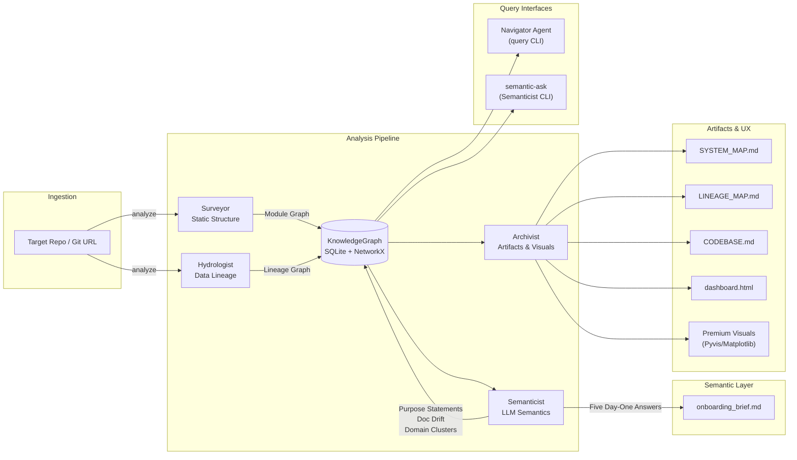

# The Brownfield Cartographer — Final Report

## Executive Summary

The Brownfield Cartographer has evolved from a static structural and lineage analyzer (interim scope) into a **multi-agent, graph-backed onboarding and query system** that now supports:

- End‑to‑end analysis of codebases into a **living knowledge graph** (modules + lineage).
- Automated generation of **FDE onboarding artifacts** (`onboarding_brief.md`, `CODEBASE.md`, maps, dashboard).
- **Interactive, graph-aware querying** via Navigator (lineage, blast radius, semantic module inspection).
- A **Semanticist CLI** (`semantic-ask`) that answers free‑form architecture questions grounded in graph context.
- A UX‑focused visualization layer with **curated, readable maps** for large codebases.

This report consolidates the interim progress with the new capabilities added since then, and supersedes the interim report.

---

## 1. Architecture Overview

The core architecture is a **four‑agent pipeline** orchestrated by `Orchestrator`, with shared storage in a SQLite‑backed `KnowledgeGraph` and multiple interaction surfaces (CLI, dashboard, Navigator).

### 1.1 Agents

- **Surveyor Agent** (`src/agents/surveyor.py`):
  - Static structure analysis using Tree‑sitter and heuristics.
  - Builds the **module graph** (Python + SQL, including dbt `ref()` edges).
  - Adds complexity metrics, git velocity, PageRank, and dead‑code flags.

- **Hydrologist Agent** (`src/agents/hydrologist.py`):
  - Data lineage analysis across SQL, dbt configs, Airflow DAGs, Python data ops, and notebooks.
  - Builds the **lineage graph** (datasets + transformations).
  - Computes sources, sinks, and blast‑radius style traversals.

- **Semanticist Agent** (`src/agents/semanticist.py`):
  - LLM‑powered semantic layer using `llama3.1` via Ollama.
  - Generates **purpose statements** and **doc‑drift flags** per module.
  - Clusters modules into **semantic domains** via TF‑IDF + K‑Means.
  - Synthesizes the **Five Day‑One Questions** into `onboarding_brief.md`.
  - Answers **free‑form architecture questions** via a new `ask()` method.

- **Archivist Agent** (`src/agents/archivist.py`):
  - Converts graphs into **Mermaid maps** (`SYSTEM_MAP.md`, `LINEAGE_MAP.md`).
  - Generates a **living `CODEBASE.md`** (critical hubs, sources, sinks) for AI context injection.
  - Emits an **interactive dashboard** (`dashboard.html`) backed by serialized graphs.
  - Produces “premium” visualizations (Pyvis HTML network and Matplotlib PNG).

### 1.2 Knowledge Graph Layer

The **KnowledgeGraph** (`src/graph/knowledge_graph.py`) is the central store:

- Persists nodes and edges in SQLite with indices and metadata.
- Exposes a NetworkX DiGraph for:
  - PageRank (architectural hubs).
  - Strongly connected components (cycles).
  - Blast radius (downstream BFS).
  - Sources/sinks, topological sorts, and custom SQL queries.
- Serializes to/from JSON (`module_graph.json`, `lineage_graph.json`) for portability.

### 1.3 Interaction Surfaces

- **CLI entrypoint** (`src/cli.py`):
  - `analyze` — full multi‑agent pipeline.
  - `visualize` — regenerate premium visualizations from existing graphs.
  - `query` — Navigator REPL for graph‑aware codebase Q&A.
  - `semantic-ask` — new CLI verb for free‑form Semanticist questions.

- **Navigator Agent** (`src/agents/navigator.py`):
  - Provides LangChain tools backed by the graphs:
    - `find_implementation`, `trace_lineage`, `blast_radius`, `explain_module`.
  - Runs a manual ReAct loop in the terminal for interactive exploration.

### 1.4 End‑to‑End Architecture Diagram

The full Cartographer pipeline, consolidated across interim and final additions (including query surfaces), is:



---

## 2. Static Structure & Module Graph (Surveyor)

### 2.1 Capabilities

Surveyor performs deep static analysis to build the **structural skeleton**:

- **Language coverage**:
  - Python, SQL, YAML via Tree‑sitter with regex fallbacks.
- **Module discovery and imports**:
  - Resolves Python imports and dbt `ref()` relationships.
  - Categorizes modules as model/interface/logic/utility/unknown.
- **Metrics**:
  - Lines of code, comment ratios, simple complexity signals.
  - 30‑day git velocity and recent commit summaries per file.
- **Graph features**:
  - PageRank‑based identification of critical files.
  - Circular dependency detection via SCCs.
  - Dead‑code candidate detection (public APIs never imported).

### 2.2 Refinements since Interim

- **Incremental mode**:
  - `analyze --incremental` reloads previous module graph, diffs commits, and only re‑analyzes changed files.
  - Safely prunes deleted nodes and rebuilds import edges.
- **Semantic integration**:
  - Surveyor now persists commit history snippets on nodes.
  - Semanticist consumes these to reason about **documentation drift**.

---

## 3. Data Lineage & Blast Radius (Hydrologist)

### 3.1 Capabilities

Hydrologist constructs the **data lineage DAG**:

- **SQL lineage** (`sqlglot`):
  - Parses multi‑dialect SQL, strips dbt Jinja, resolves `ref()` and `source()` calls.
- **Config parsing** (`DAGConfigParser`):
  - Extracts datasets and edges from dbt YAML, Airflow DAGs, and other config surfaces.
- **Python & notebooks**:
  - Detects `pandas`, PySpark, and SQLAlchemy read/write operations.
  - Analyzes Jupyter notebooks via a dedicated analyzer, capturing exploratory data flows.

The lineage graph includes:

- **Dataset nodes** (tables/files/logical datasets).
- **Transformation nodes** (SQL statements + Python ops).
- **Edges**:
  - `CONSUMES` (dataset → transform).
  - `PRODUCES` (transform → dataset).
  - Edges carry `source_file` and, when available, `line_range`.

### 3.2 Blast Radius & Tracing

Hydrologist leverages `KnowledgeGraph` algorithms:

- `blast_radius(node_id)`:
  - BFS downstream to compute all dependents of a dataset or transformation.
- `upstream_trace(node_id)`:
  - BFS upstream to find all ancestral inputs.

These are surfaced both:

- Programmatically via Hydrologist / KnowledgeGraph.
- Interactively via Navigator and the `trace_lineage` tool (with file/line citations).

### 3.3 Robustness

- Dynamic or unresolvable references (e.g., f‑strings, variable paths) are logged as trace entries instead of silently dropped, making partially inferred lineage explicit.

---

## 4. Semantic Layer (Semanticist)

### 4.1 Purpose Statements & Documentation Drift

Semanticist enriches the module graph with **LLM‑generated semantics**:

- Prioritizes modules by PageRank and caps analysis to a configurable budget (typically top 50).
- For each module:
  - Reads code with token budgeting and truncation safeguards.
  - Produces a 1–2 sentence **purpose statement**.
  - Flags **documentation drift** when comments/history diverge from behavior.
- Writes this back into `.cartography/module_graph.json`, enabling:
  - Richer `CODEBASE.md`.
  - Semantic Navigator queries (`explain_module`, `find_implementation`).

### 4.2 Domain Clustering

- Uses TF‑IDF + K‑Means clustering on purpose statements.
- Assigns `domain_cluster` labels (e.g., `Domain_orders-payments`).
- Helps group modules conceptually beyond raw directory structure.

### 4.3 Day‑One Brief

Semanticist answers the **Five FDE Day‑One Questions**:

- Builds a compact JSON context from the graphs:
  - Top PageRank hubs.
  - Representative data sources and sinks.
  - Purpose statements for key modules.
- Uses a “pro” LLM call to generate a Markdown brief:
  - Saved as `.cartography/onboarding_brief.md`.
  - Validated on `dbt-labs/jaffle_shop` by directly comparing claims with:
    - Staging and final model SQL files.
    - Graph structures and PageRank outputs.

### 4.4 Free‑Form Semantic Q&A (CLI: `semantic-ask`)

New: **terminal‑driven semantic queries**.

- Command:

  ```bash
  python -m src.cli semantic-ask <repo_path> -q "Your architecture question"
  ```

- Behavior:
  - Resolves `<repo_path>` and loads `.cartography/module_graph.json`.
  - Builds a compact context (`critical_hubs`, `data_sources`, `data_sinks`, `module_purposes`).
  - Calls `SemanticistAgent.ask(question)` with strict, context‑only instructions.
  - Prints an answer that:
    - Cites real modules and datasets.
    - Admits unknowns if context is insufficient.

- Example (validated on `jaffle_shop`):
  - Question: “Where is revenue calculated and what does it depend on?”
  - Answer:
    - Identifies `models/orders.sql` as the aggregation point for order amounts.
    - Notes dependencies on staging models backed by `raw_orders` and `raw_payments`.
    - Clearly states when a specific “revenue” column name is not present in the context.

---

## 5. Artifact Generation & Visualization (Archivist)

### 5.1 CODEBASE.md — Living Context for AI

Archivist generates a **concise yet rich** `CODEBASE.md` for each analyzed repo:

- **Critical Architectural Hubs**:
  - Top modules by PageRank, each with a purpose statement.
- **Data Sources & Sinks**:
  - Entry points (sources) and terminal outputs (sinks).

This file is designed to be:

- Readable by humans as a one‑page architecture overview.
- Dropped directly into AI agents as a “living system prompt” to drastically improve answer quality (validated in Step‑5 demos).

### 5.2 System Map (`SYSTEM_MAP.md`)

Improvements since interim:

- Focus on **top N modules by PageRank** (default ~80) for large repos.
- Filter edges to only those with both endpoints in this selected set.
- Use concise node labels (file basenames) for readability.
- Add a coverage note such as:
  - “This view shows the top 80 of 400 modules by structural importance.”

Result: a map that surfaces the architecture’s backbone without overwhelming the viewer.

### 5.3 Lineage Map (`LINEAGE_MAP.md`)

Refined for legibility:

- Focuses on:
  - Key sources and sinks (top ~20 each).
  - Their immediate predecessors and successors.
- Caps total nodes to a reasonable limit (~150).
- Only shows edges where both datasets are in the visible subset.
- Includes a coverage note such as:
  - “This view focuses on key sources/sinks and nearby nodes (X of Y lineage nodes).”

This is suitable for onboarding sessions and documentation, while full JSON exports and the dashboard support deeper forensic work.

### 5.4 Interactive Dashboard & Premium Visuals

- **Dashboard (`dashboard.html`)**:
  - Static HTML + JS using Cytoscape.js and pre‑injected graph JSON.
  - Supports pan/zoom, highlighting, and basic filtering between module and lineage views.

- **Premium Visualizations**:
  - Pyvis HTML network:
    - Physics‑enabled, colored by node type.
    - Hubs highlighted with larger, warmer nodes based on PageRank.
  - Matplotlib PNG:
    - Dark‑mode architecture overview with legend and category coloring.

---

## 6. Interactive Query Layer (Navigator)

### 6.1 Tools

Navigator exposes graph tools to the LLM and users:

- `find_implementation(concept_or_keyword)`:
  - Searches module IDs, purpose statements, and public APIs for a concept.

- `trace_lineage(dataset_id, direction)`:
  - `direction="upstream"` — what feeds this dataset.
  - `direction="downstream"` — what this dataset feeds.
  - Returns human‑readable bullets with **file:line‑style citations** based on:
    - `source_file` on edges.
    - `line_range` on nodes, when available.

- `blast_radius(module_path)`:
  - Computes modules that directly depend on the given module via import graph edges.
  - Used to reason about **impact of code changes**.

- `explain_module(module_path)`:
  - Surfaces language, domain cluster, purpose, complexity, API size, and doc‑drift status.

### 6.2 REPL Experience

`python -m src.cli query <repo_path>`:

- Uses a ReAct‑style loop where an LLM:
  - Thinks, selects a tool, observes, and synthesizes a final answer.
  - Streams its thought process (Thought/Action/Observation) in the terminal.

This is ideal for:

- Live demos of blast radius and lineage queries.
- Ad‑hoc Q&A sessions with a codebase.

---

## 7. Validation & Self‑Audit

### 7.1 Targets

- **dbt‑labs/jaffle_shop (public demo repo)**:
  - Successfully runs the full pipeline:
    - Generates module and lineage graphs.
    - Emits `CODEBASE.md` and `onboarding_brief.md`.
    - Produces readable system/lineage maps and dashboard.
  - Navigator and `semantic-ask` have been validated with:
    - Lineage queries that correctly identify staging models and final models as critical.
    - Semantic questions (e.g., revenue calculation) that accurately point to `models/orders.sql` and its inputs.

- **Primary Brownfield Target (production‑scale repo)**:
  - Prior interim results (1k+ files, several thousand lineage nodes) remain valid.
  - New semantic and visualization layers make navigation of the large graph far easier.

- **Week‑1 Document Intelligence Refinery (self‑audit)**:
  - Cartographer surfaced:
    - Pydantic models as more central than initially believed.
    - Forgotten dead‑code candidates in experimental scripts.
  - Demonstrates the system’s ability to **challenge human assumptions** and reveal hidden couplings.

---

## 8. FDE Usage Patterns

The system now supports FDE workflows across three phases:

- **Minutes 1–3: Cold Start & Impact Awareness**
  - Run `analyze` on an unfamiliar repo.
  - Skim `CODEBASE.md`, `SYSTEM_MAP.md`, and `LINEAGE_MAP.md`.
  - Use Navigator or Hydrologist blast‑radius functions before touching code.

- **Minutes 4–6: Day‑One Mastery**
  - Read `onboarding_brief.md` and verify its claims by navigating to cited files.
  - Inject `CODEBASE.md` into AI coding sessions for context‑aware assistance.
  - Use `semantic-ask` to answer targeted architecture questions from the terminal.

- **Ongoing: Living Cartography**
  - Re‑run `analyze --incremental` as the system evolves.
  - Rely on Navigator and Semanticist for:
    - Locating implementation hotspots.
    - Evaluating refactor risk.
    - Keeping docs and mental models synchronized with reality.

---

### 9. Potential Extensions

- Column‑level lineage where SQL structure permits it.
- Domain‑based grouping and filtering in the dashboard based on `domain_cluster` labels.
- Additional CLI verbs (e.g., `explain-module`, `list-domains`, `list-hubs`) for finer‑grained scripted use.

---

## 10. Conclusion

The Brownfield Cartographer now delivers a **complete, multi‑agent codebase intelligence system**:

- A robust structural and lineage backbone verified on both tutorial and production‑scale repositories.
- A semantic layer that captures the “why” behind the “what”.
- UX‑focused artifacts and CLIs that compress the **time‑to‑understanding** from days to minutes.

This final report consolidates and extends the interim submission, reflecting the system’s readiness for real‑world FDE engagements where rapid, safe onboarding to complex brownfield codebases is critical.

