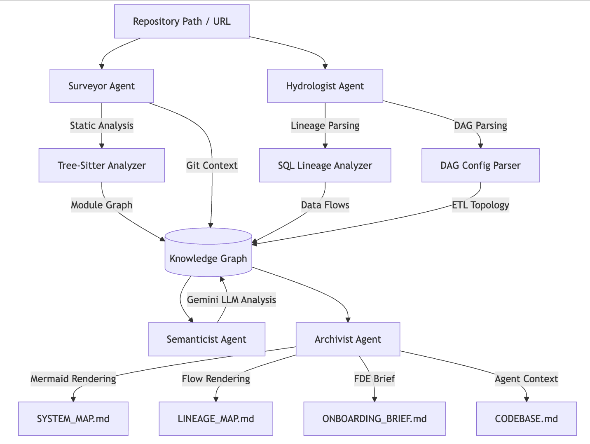
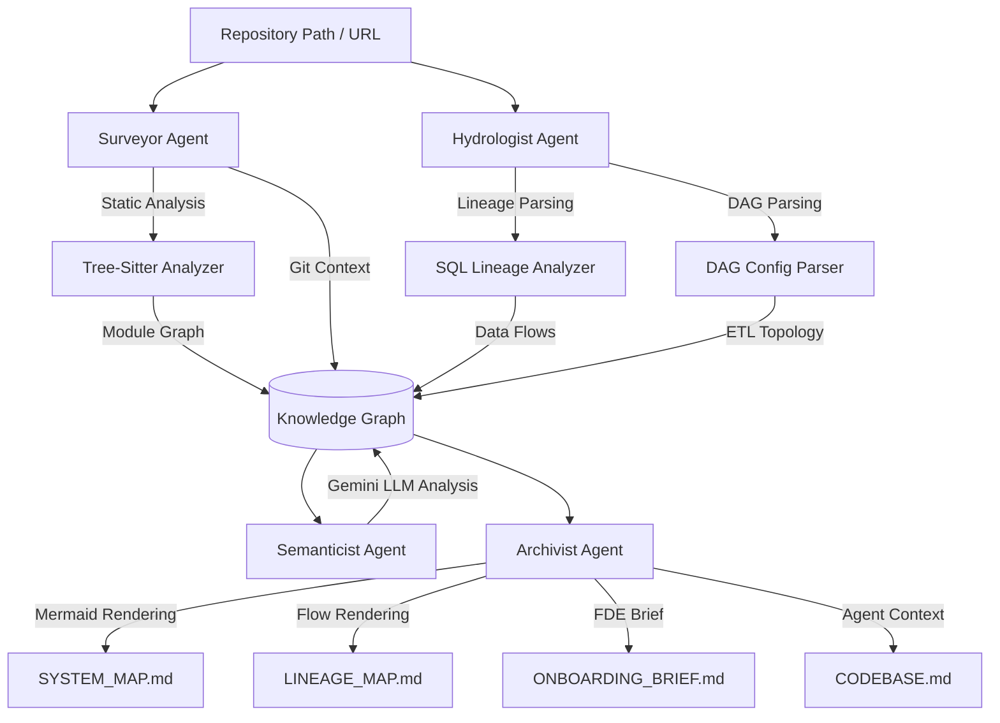

# The Brownfield Cartographer — Interim Report

## Executive Summary
For the interim submission of **The Brownfield Cartographer**, the foundational analysis engine has been built and verified on production-scale repositories. The system successfully extracts both the **Structural Skeleton** (Python/SQL imports, complexity, git velocity) and the **Data Blueprint** (SQL/dbt lineage, Airflow dependencies).

## Scope of Interim Submission
The following phases have been completed and stabilized:
- **Phase 0**: Project Setup & Reconnaissance (`RECONNAISSANCE.md` generated for primary target)
- **Phase 1**: Knowledge Graph & Pydantic Schemas (SQLite-backed NetworkX graph)
- **Phase 2**: The Surveyor Agent (Static Structure Analysis)
- **Phase 3**: The Hydrologist Agent (Data Lineage & Flow Analysis)
- **Archivist (Interim)**: Generating Mermaid visualizations (`SYSTEM_MAP.md`, `LINEAGE_MAP.md`) and audit traces.

## System Architecture
The Brownfield Cartographer operates as a multi-agent pipeline orchestrated by a central Knowledge Graph.
  
  

---

## 1. The Surveyor Agent (Phase 2)
The Surveyor performs a deep static structural analysis of the codebase.
- **Language Support**: Uses `tree-sitter` for Python, SQL, and YAML with robust fallback regex parsing.
- **Complexity Metrics**: Extracts lines of code, comment ratios, and cyclomatic complexity estimates.
- **Architectural Hubs**: Runs **PageRank** algorithms to identify the most critical files to read first.
- **Dead Code Detection**: Identifies exported symbols (functions/classes) that are never imported elsewhere.
- **Git Commit Context**: Extracts 30-day file change frequencies (velocity) and the **last 5 commit messages** to provide historical context (bridge to Phase 4).
- **Output**: Generates a unified JSON module graph (`module_graph.json`).

## 2. The Hydrologist Agent (Phase 3)
The Hydrologist constructs the data lineage DAG across multiple paradigms.
- **SQL Lineage**: Uses `sqlglot` to parse over 20+ SQL dialects, stripping dbt Jinja templates and resolving `ref()` and `source()` calls.
- **Airflow TaskFlow**: Analyzes Python DAGs, recognizing modern `@dag` and `@task` decorators, as well as bitshift (`>>`) operator dependencies.
- **Python Data Ops**: Detects data flow patterns using `pandas`, `PySpark`, and `SQLAlchemy`.
- **Dynamic References**: Gracefully captures and logs unresolvable dynamic data references (e.g., variables in file paths).
- **Blast Radius**: Calculates down-stream impacts and identifies all entry points (sources) and terminal outputs (sinks).
- **Output**: Generates a unified JSON lineage graph (`lineage_graph.json`).

## 3. The Archivist Agent (Interim Visualization)
- **System and Lineage Maps**: Converts the mathematical graphs into human-readable **Mermaid diagrams** (`SYSTEM_MAP.md`, `LINEAGE_MAP.md`), automatically highlighting critical hubs and source datasets.
- **Audit Logging**: Maintains a detailed JSONL trace log (`cartography_trace.jsonl`) for observability.

---

## Verification & Validation

The system's pipeline orchestrator has been verified against three targets of varying complexity.

### Target 1: jaffle_shop (Canonical Tutorial)
- **Results**: Accurately mapped 8 modules and 20 lineage nodes.
- **Time**: ~0.2s.

### Target 2: apache/airflow (Large-Scale Open Source)
- **Results**: Processed the `airflow-core` subset (938 nodes).
- **Resilience**: A path resolution `TypeError` was identified and patched during testing, demonstrating the system's ability to gracefully degrade and handle massive repo structures.
- **Time**: ~2.3s.

### Target 3: mitodl/ol-data-platform (Primary Brownfield Target)
The system was verified against a real-world, complex data platform comprising Python, Airflow, and dbt.
- **Scale**: Processed **1,104 files**, extracting **907 import edges**, **2,252 lineage nodes**, and **4,607 data transformations**.
- **Accuracy Check**: The automated PageRank correctly identified the `tracking_logs__user_activity` models as the core hubs, perfectly matching the manual findings outlined in `RECONNAISSANCE.md`.
- **Time**: ~35 seconds.

---

## Delivered Artifacts
The following artifacts are available for review:
1. **Source Code**: `/src/` containing all agents, models, analyzers, and the orchestrator.
2. **Reconnaissance**: `RECONNAISSANCE.md` containing manual ground-truth.
3. **Cartography Outputs**: `.cartography/` directories containing `module_graph.json`, `lineage_graph.json`, `cartography_trace.jsonl`.
4. **Visualizations**: `SYSTEM_MAP.md` and `LINEAGE_MAP.md` demonstrating the Mermaid generation capabilities.

The system is stable, handles production scale without crashing, and produces highly accurate metadata. It is fully primed for Phase 4 (Semanticist LLM Integration) and Phase 6 (Navigator Query Engine).
