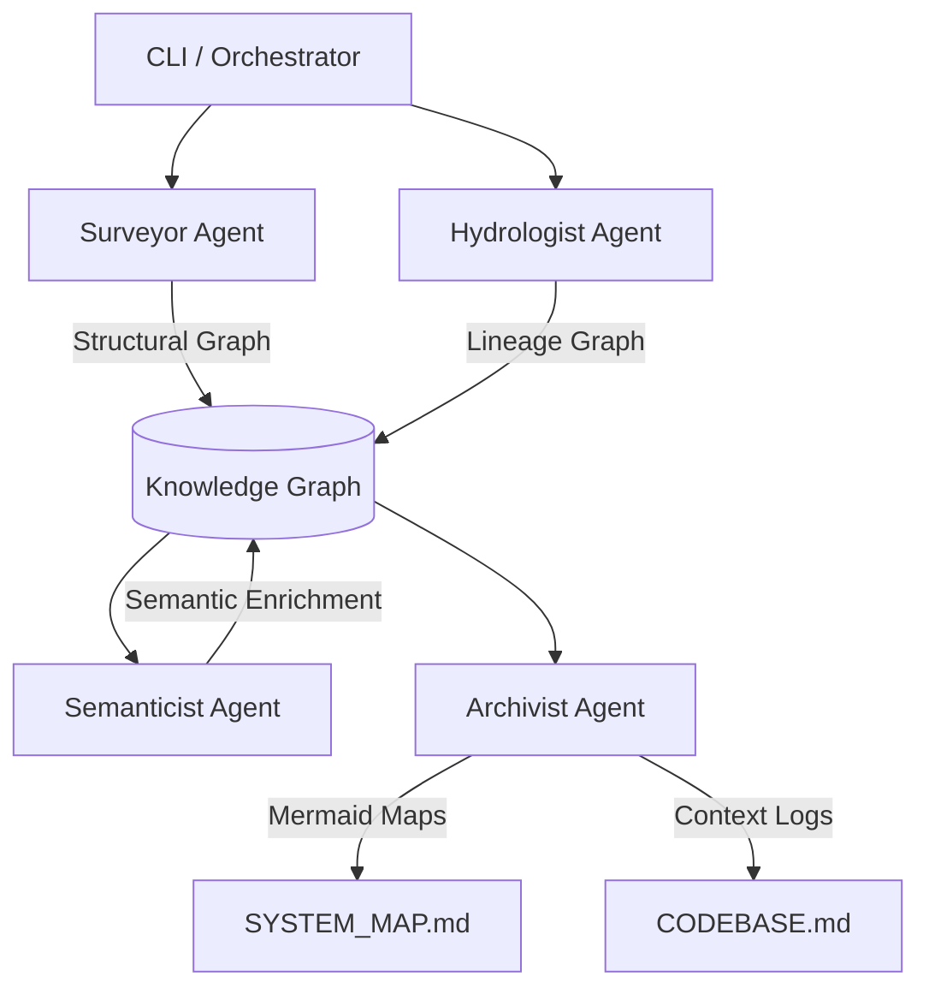

# The Brownfield Cartographer

**A multi-agent codebase intelligence system for rapid FDE onboarding in production environments.**

The Cartographer ingests any GitHub repository or local path and produces a living, queryable knowledge graph of the system's architecture, data flows, and semantic structure.

## Installation

```bash
# Clone the repository
git clone <your-repo-url>
cd week4

# Install dependencies
pip install -e .
```

## Quick Start

### Analyze a Codebase

```bash
# Analyze a local directory
python -m src.cli analyze ./targets/jaffle_shop

# Analyze a GitHub repository (auto-cloned)
python -m src.cli analyze https://github.com/dbt-labs/jaffle_shop

# Specify custom output directory
python -m src.cli analyze ./targets/jaffle_shop --output ./results
```

### View Results

After analysis, artifacts are saved to `<repo>/.cartography/`:

| Artifact | Description |
|----------|-------------|
| `module_graph.json` | Module import graph with PageRank, complexity scores, dead code candidates |
| `lineage_graph.json` | Data lineage DAG: sources → transformations → sinks |
| `cartography_trace.jsonl` | Audit log of all analysis actions |

## Architecture

The Cartographer implements a multi-agent orchestration pattern:



### Agents

- **Surveyor**: Static structure analyst — tree-sitter AST parsing, module import graph, PageRank, git velocity, dead code detection
- **Hydrologist**: Data flow analyst — SQL lineage (sqlglot), dbt/Airflow config parsing, Python data operations, blast radius

### Analyzers

- **TreeSitterAnalyzer**: Multi-language AST parsing (Python, SQL, YAML) with regex fallbacks
- **SQLLineageAnalyzer**: sqlglot-based SQL dependency extraction with dbt Jinja stripping
- **DAGConfigParser**: Airflow DAG and dbt YAML configuration parsing

## Project Structure

```
src/
├── cli.py                          # CLI entry point
├── orchestrator.py                 # Pipeline orchestration
├── models/
│   ├── nodes.py                    # Pydantic node schemas
│   ├── edges.py                    # Pydantic edge schemas
│   └── graphs.py                   # Graph metadata
├── analyzers/
│   ├── tree_sitter_analyzer.py     # Multi-language AST parsing
│   ├── sql_lineage.py              # SQL dependency extraction
│   └── dag_config_parser.py        # Airflow/dbt config parsing
├── agents/
│   ├── surveyor.py                 # Static structure agent
│   └── hydrologist.py              # Data lineage agent
└── graph/
    └── knowledge_graph.py          # NetworkX wrapper
```

## Dependencies

- **tree-sitter**: Language-agnostic AST parsing (Python, SQL, YAML)
- **sqlglot**: SQL parsing and lineage extraction (20+ dialects)
- **NetworkX**: Graph construction, PageRank, SCC detection
- **Pydantic**: Typed data models for the knowledge graph schema
- **Click**: CLI framework
- **GitPython**: Git log analysis for change velocity
- **Rich**: Terminal output formatting
- **Ollama**: Local LLM provider for Semanticist/Navigator agents (run `ollama pull llama3.1` before analyzing)
