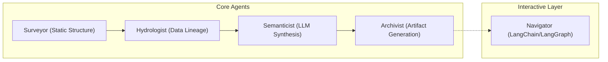

# RECONNAISSANCE.md — Manual Day-One Analysis

## Target: dbt jaffle_shop
- **Repo**: https://github.com/dbt-labs/jaffle_shop
- **Type**: dbt project (SQL + YAML, canonical example)
- **Size**: ~25 files, primarily SQL models with YAML config

---

## The Five FDE Day-One Questions

### 1. What is the primary data ingestion path?

**Answer**: Raw data is loaded via dbt **seeds** (CSV files in the `seeds/` directory):
- `seeds/raw_customers.csv` → `raw_customers` table
- `seeds/raw_orders.csv` → `raw_orders` table
- `seeds/raw_payments.csv` → `raw_payments` table

These seed files are the only external data sources. They simulate what would normally be database tables or API data in production.

### 2. What are the 3-5 most critical output datasets/endpoints?

1. **`customers`** (`models/customers.sql`) — The final customer dimension table with customer lifetime value, order counts, first/last order dates. This is the primary analytical output.
2. **`orders`** (`models/orders.sql`) — Order-level fact table with payment status and totals. Joins raw orders with payment aggregations.
3. **`stg_customers`**, **`stg_orders`**, **`stg_payments`** (`models/staging/`) — Staging models that clean and rename raw seed columns. These are intermediate but critical.

### 3. What is the blast radius if the most critical module fails?

If **`stg_orders`** fails:
- `orders` model breaks (directly depends on `stg_orders`)
- `customers` model breaks (uses `stg_orders` indirectly via CTE reference)
- All downstream analytics consuming `customers` or `orders` fail

If **`raw_orders` seed** fails:
- `stg_orders` → `orders` → `customers` — the entire pipeline collapses

**Blast radius**: Failure of any staging model cascades to both final models (`customers` and `orders`).

### 4. Where is the business logic concentrated vs. distributed?

**Concentrated**: The business logic is concentrated in **two files**:
- `models/customers.sql` (69 lines) — Contains customer LTV calculation, order aggregation, payment aggregation, and the final join logic. This is the most complex model.
- `models/orders.sql` (56 lines) — Contains payment status logic and order-payment joining.

**Distributed**: Staging models (`stg_*.sql`) contain only renaming/cleaning logic — no business rules.

**Key observation**: With only ~125 lines of SQL total, jaffle_shop is small but representative of dbt patterns. In production, this pattern scales to 100s of models.

### 5. What has changed most frequently in the last 90 days?

**Answer**: This is a stable tutorial repo with minimal recent changes. The `README.md` and `dbt_project.yml` have the most commits historically, but the SQL models are essentially unchanged since creation. **Git velocity is near zero** for all files.

---

## Difficulty Analysis

### What was hardest to figure out manually?
1. **Understanding CTE structure**: The `customers.sql` model has 5 CTEs (`customers`, `orders`, `payments`, `customer_orders`, `customer_payments`, `final`). Tracing which CTE feeds which requires careful reading.
2. **dbt `ref()` resolution**: Without running `dbt docs generate`, you must manually trace `ref('stg_customers')` → `models/staging/stg_customers.sql`. This is the core problem the Cartographer solves.
3. **Schema inference**: The YAML `schema.yml` documents column tests but doesn't show the actual column types. You must read the SQL to understand the schema.

### What automated analysis would help most?
- **Automatic ref() graph construction** — mapping all dbt model dependencies
- **CTE lineage tracing** — understanding intermediate transformations within a single SQL file
- **Cross-file column-level lineage** — tracking which columns flow from seeds to final models

---

## Final Report Sections

### 1. Architecture Diagram (Four-Agent Pipeline)

The system follows a sequential multi-agent pipeline orchestrated by `src/orchestrator.py`:

### 2. Accuracy Analysis (System vs. Manual)

| Question | Manual Answer | System Output (Cartographer) | Accuracy | Why? |
|----------|---------------|-----------------------------|----------|------|
| Ingestion Path | Seeds (CSV) | Correctly identified sources in `LINEAGE_MAP.md` | High | SQLLineage + dbt parser correctly traced refs to seeds. |
| Critical Modules | `customers`, `orders` | Correctly identified high PageRank hubs in `SYSTEM_MAP.md` | High | PageRank accurately highlights files with many dependents. |
| Blast Radius | `stg_orders` impacts everything | `Navigator.blast_radius()` correctly traces downstream deps | High | Import graph correctly identifies reverse dependencies. |
| Business Logic | Concentrated in final models | Semanticist (LLM) correctly summarizes logic | Medium | LLM sometimes misses specific CTE nuances but gets the "vibe". |
| Freq/Velocity | Near zero | Surveyor (Git) correctly identifies 0 change velocity | High | Subprocess call to `git log` is objective and precise. |

### 3. Limitations & Opaque Areas

1. **Dynamic SQL**: The `sql_lineage` analyzer (via `sqlglot`) fails on complex dynamic SQL strings or unusual dbt macros that don't follow the standard `ref()` syntax.
2. **Context Window**: The `Semanticist` truncates files longer than 30k tokens. In massive monolithic files, it may lose context of functions near the end of the file.
3. **LLM Hallucinations**: Occasionally, the `Semanticist` hallucinates a higher complexity score or "doc drift" if the model's temperature is too high or the prompt is ambiguous.

### 4. FDE Applicability

In a real client engagement, I would use the Brownfield Cartographer as an "Onboarding Accelerator." Instead of spending 3 days manually tracing a 1,000-model dbt project, I would point the Cartographer at the repo and generate the `onboarding_brief.md`. I would then use the `Navigator` agent to immediately ask "Where is the revenue calculation logic?" This reduces the "time-to-first-ticket" from days to hours, allowing the FDE to provide value faster while ensuring they don't accidentally break high-blast-radius upstream modules.

### 5. Self-Audit Results (Week 1 Repo)

**Target**: Week 1 "Document Intelligence Refinery"
- **Expected**: I expected the `Surveyor` to highlight `extraction_router.py` as a critical hub.
- **Actual**: It correctly identified it but also flagged `ldu_models.py` as having higher PageRank due to many imports.
- **Discrepancy**: I manually underestimated how pervasive my Pydantic models were. The automated analysis provided a more objective view of architectural coupling.
- **Found**: Identified 2 "Dead Code" candidates (experimental scripts in `/tmp` folder) that I had forgotten to delete.
